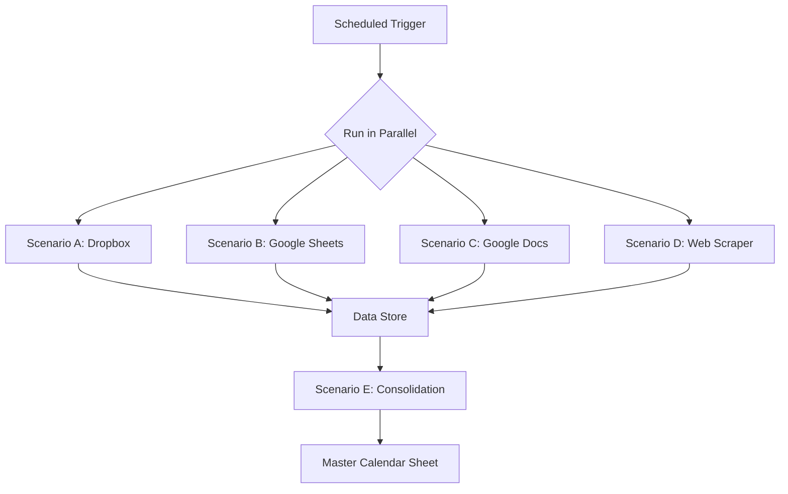

# Make.com Workflow Blueprint - Yacht Booking Consolidation

## Overview

This document provides detailed specifications for building the yacht booking consolidation automation in Make.com. The system will fetch data from 7 different sources, normalize it, and output a unified availability calendar.

## Scenario Architecture

### Main Scenarios

1. **Scenario A:** Dropbox Excel Files Processor
2. **Scenario B:** Google Sheets Processor  
3. **Scenario C:** Google Docs Processor
4. **Scenario D:** Web Scraper
5. **Scenario E:** Data Consolidation & Master Sheet Generator

### Execution Flow



## Scenario A: Dropbox Excel Files Processor

### Purpose
Fetch and parse Excel files from Dropbox containing yacht booking data.

### Modules Configuration

#### Module 1: Dropbox - Download File (Booking-list-2026.xlsx)
**Settings:**
- File Path: `/Booking-list-2026.xlsx`
- Output: Binary data

#### Module 2: Parse Excel
**Settings:**
- Input: Binary data from Module 1
- Sheet: First sheet or specify name
- Range: All data
- First row contains headers: Yes

#### Module 3: Iterator
**Settings:**
- Array: Rows from Module 2
- Skip first row: Yes (if headers)

#### Module 4: Router
**Purpose:** Route to different transformation logic based on data structure

**Route 1: Standard Format**
- Condition: Check if expected columns exist

**Route 2: Alternative Format**
- Condition: Different column structure

#### Module 5: Data Transformer (for each route)
**Operations:**
```javascript
// Pseudo-code for transformation
{
  yacht_name: extractYachtName(row),
  start_date: parseDate(row.start_date),
  end_date: parseDate(row.end_date),
  embarkation_port: normalizePort(row.embark),
  disembarkation_port: normalizePort(row.disembark),
  status: "occupied",
  source: "Dropbox-Booking-list-2026",
  last_updated: now()
}
```

**Date Parsing Function:**
```javascript
function parseDate(dateString) {
  // Handle multiple formats
  const formats = [
    "YYYY-MM-DD",
    "DD.MM.YYYY",
    "MM/DD/YYYY",
    "DD/MM/YYYY",
    "MMMM DD, YYYY",
    "DD MMMM YYYY"
  ];
  
  for (let format of formats) {
    try {
      return parseWithFormat(dateString, format);
    } catch (e) {
      continue;
    }
  }
  
  // Handle date ranges like "July 4-11"
  if (dateString.includes("-")) {
    return parseDateRange(dateString);
  }
  
  throw new Error("Unable to parse date: " + dateString);
}
```

**Port Normalization Function:**
```javascript
function normalizePort(portString) {
  const portMap = {
    "SPL": "Split",
    "DBV": "Dubrovnik",
    "ATH": "Athens",
    "MYK": "Mykonos",
    "VCE": "Venice",
    // Add more mappings
  };
  
  const cleaned = portString.trim().toUpperCase();
  return portMap[cleaned] || portString;
}
```

#### Module 6: Data Store - Add Record
**Settings:**
- Data Store: "yacht_bookings_temp"
- Record: Transformed data from Module 5

#### Module 7: Dropbox - Download File (Saint Luca booking2026.xlsx)
**Settings:**
- File Path: `/Saint Luca/Saint Luca - booking2026.xlsx`
- Output: Binary data

#### Modules 8-12: Repeat steps 2-6 for Saint Luca file

### Error Handling
- Add error handler to each Dropbox module
- On error: Log to error data store
- Continue execution (don't stop entire scenario)

---

## Scenario B: Google Sheets Processor

### Purpose
Fetch and parse data from Google Sheets containing yacht booking data.

### Modules Configuration

#### Module 1: Google Sheets - Get Range Values (Sheet 1)
**Settings:**
- Spreadsheet ID: `1Tfz1IPfd_e-I97LQKeQ6qUKs9zrlJ1TuqOa1aSlz9KM`
- Sheet Name: First sheet or specify
- Range: A1:Z1000 (adjust as needed)
- Value Render Option: FORMATTED_VALUE

#### Module 2: Iterator
**Settings:**
- Array: Values from Module 1
- Skip first row: Yes (if headers)

#### Module 3: Tools - Set Multiple Variables
**Purpose:** Extract yacht names from header row
**Variables:**
- yacht_columns: Array of column indices with yacht names
- date_column: Column index for dates

#### Module 4: Iterator (nested)
**Settings:**
- Array: yacht_columns from Module 3

#### Module 5: Tools - Get Variable
**Purpose:** Get booking data for current yacht and date

#### Module 6: Filter
**Condition:** Cell is not empty AND not "AVAILABLE"

#### Module 7: Text Parser
**Purpose:** Extract embarkation and disembarkation ports from cell content
**Pattern:**
```regex
Embark:\s*([^\n]+)\s*Disembark:\s*([^\n]+)
```

#### Module 8: Data Transformer
**Operations:**
```javascript
{
  yacht_name: normalizeYachtName(current_yacht),
  start_date: parseDate(current_date),
  end_date: calculateEndDate(current_date, duration),
  embarkation_port: normalizePort(parsed_embark),
  disembarkation_port: normalizePort(parsed_disembark),
  status: "occupied",
  source: "GoogleSheets-1Tfz1IPfd",
  last_updated: now()
}
```

**Yacht Name Normalization:**
```javascript
function normalizeYachtName(name) {
  const yachtMap = {
    "ANGELICA": "Angelica",
    "M/Y ANGELICA": "Angelica",
    "Angelica": "Angelica",
    "SAINT LUCA": "Saint Luca",
    "St. Luca": "Saint Luca",
    // Add more mappings
  };
  
  const cleaned = name.trim();
  return yachtMap[cleaned] || cleaned;
}
```

#### Module 9: Data Store - Add Record
**Settings:**
- Data Store: "yacht_bookings_temp"
- Record: Transformed data from Module 8

#### Modules 10-18: Repeat for second Google Sheet
**Settings:**
- Spreadsheet ID: `1qrcGvth_FGTqQQTJGNWzQ6EkWBudFwsX`
- Same logic as above

### Error Handling
- Add error handler for authentication failures
- Retry logic for rate limit errors
- Log errors to data store

---

## Scenario C: Google Docs Processor

### Purpose
Extract booking data from Google Docs (if structured data exists).

### Modules Configuration

#### Module 1: Google Docs - Get a Document
**Settings:**
- Document ID: `1NhdYhkkzNLShxrgCfasAXJ_GShn8Lkjd`

#### Module 2: Text Parser - Match Pattern
**Purpose:** Extract booking information using regex
**Patterns:**
```regex
Yacht:\s*([^\n]+)
Date:\s*([^\n]+)
Embark:\s*([^\n]+)
Disembark:\s*([^\n]+)
```

#### Module 3: Iterator
**Settings:**
- Array: Matches from Module 2

#### Module 4: Data Transformer
**Operations:**
```javascript
{
  yacht_name: normalizeYachtName(match.yacht),
  start_date: parseDate(match.date),
  end_date: parseDate(match.date), // or calculate
  embarkation_port: normalizePort(match.embark),
  disembarkation_port: normalizePort(match.disembark),
  status: "occupied",
  source: "GoogleDocs-1NhdYhkkz",
  last_updated: now()
}
```

#### Module 5: Data Store - Add Record
**Settings:**
- Data Store: "yacht_bookings_temp"
- Record: Transformed data from Module 4

### Note
If Google Doc doesn't contain structured booking data, this scenario may be simplified or skipped.

---

## Scenario D: Web Scraper

### Purpose
Scrape booking data from web pages.

### Modules Configuration

#### Module 1: HTTP - Make a Request (ViewYacht)
**Settings:**
- URL: `https://www.viewyacht.com/angelica/index.php/4`
- Method: GET
- Headers: User-Agent (to avoid blocking)

#### Module 2: HTML - Parse HTML
**Settings:**
- HTML: Response from Module 1
- Selector: `table.booking-calendar` (adjust based on actual structure)

#### Module 3: Text Parser - Match Pattern
**Purpose:** Extract booking data from HTML
**Pattern:** Depends on actual HTML structure

#### Module 4: Iterator
**Settings:**
- Array: Parsed bookings from Module 3

#### Module 5: Data Transformer
**Operations:**
```javascript
{
  yacht_name: "Angelica", // Known from URL
  start_date: parseDate(booking.start),
  end_date: parseDate(booking.end),
  embarkation_port: normalizePort(booking.embark),
  disembarkation_port: normalizePort(booking.disembark),
  status: "occupied",
  source: "Web-ViewYacht-Angelica",
  last_updated: now()
}
```

#### Module 6: Data Store - Add Record
**Settings:**
- Data Store: "yacht_bookings_temp"
- Record: Transformed data from Module 5

#### Modules 7-12: Repeat for Aboard Yachting website
**Settings:**
- URL: `https://abordayachting.hr/yachting-croatia-2/`
- Similar logic

### Error Handling
- Handle HTTP errors (404, 500, etc.)
- Handle parsing errors if HTML structure changes
- Add retry logic with exponential backoff

---

## Scenario E: Data Consolidation & Master Sheet Generator

### Purpose
Consolidate all normalized booking data and generate the master availability calendar.

### Modules Configuration

#### Module 1: Tools - Set Variable
**Purpose:** Define date range for calendar
**Variables:**
- start_date: "2026-01-01"
- end_date: "2026-12-31"
- interval: "weekly" or "daily"

#### Module 2: Tools - Compose
**Purpose:** Generate array of date ranges
**Formula:**
```javascript
// Generate weekly date ranges for 2026
const ranges = [];
let current = new Date("2026-01-01");
const end = new Date("2026-12-31");

while (current <= end) {
  const rangeStart = formatDate(current);
  const rangeEnd = formatDate(addDays(current, 6));
  ranges.push({
    start: rangeStart,
    end: rangeEnd,
    label: rangeStart + " to " + rangeEnd
  });
  current = addDays(current, 7);
}

return ranges;
```

#### Module 3: Data Store - Search Records
**Purpose:** Get all yacht names (distinct)
**Settings:**
- Data Store: "yacht_bookings_temp"
- Query: All records
- Output: Distinct yacht names

#### Module 4: Array Aggregator
**Purpose:** Build list of unique yacht names
**Settings:**
- Source Module: Module 3
- Aggregation: Unique values of yacht_name

#### Module 5: Iterator (Date Ranges)
**Settings:**
- Array: Date ranges from Module 2

#### Module 6: Iterator (Yachts) - nested
**Settings:**
- Array: Yacht names from Module 4

#### Module 7: Data Store - Search Records
**Purpose:** Check if yacht is booked for current date range
**Settings:**
- Data Store: "yacht_bookings_temp"
- Filter:
  - yacht_name = current_yacht
  - start_date <= current_range_end
  - end_date >= current_range_start

#### Module 8: Router
**Route 1: Yacht is Booked**
- Condition: Records found in Module 7

**Route 2: Yacht is Available**
- Condition: No records found

#### Module 9a: Tools - Compose (Booked)
**Output:**
```javascript
{
  date_range: current_range_label,
  yacht: current_yacht,
  status: "OCCUPIED",
  embark: booking.embarkation_port,
  disembark: booking.disembarkation_port,
  cell_value: "OCCUPIED\nEmbark: " + booking.embarkation_port + "\nDisembark: " + booking.disembarkation_port
}
```

#### Module 9b: Tools - Compose (Available)
**Output:**
```javascript
{
  date_range: current_range_label,
  yacht: current_yacht,
  status: "AVAILABLE",
  embark: "",
  disembark: "",
  cell_value: "AVAILABLE"
}
```

#### Module 10: Array Aggregator
**Purpose:** Collect all cells for the matrix
**Settings:**
- Source Module: Module 9a and 9b
- Group by: date_range

#### Module 11: Google Sheets - Clear a Range
**Purpose:** Clear existing master calendar
**Settings:**
- Spreadsheet: Master calendar sheet
- Sheet Name: "Yacht Availability 2026"
- Range: A1:ZZ1000

#### Module 12: Tools - Compose
**Purpose:** Build header row
**Output:**
```javascript
["Date Range", ...yacht_names]
```

#### Module 13: Google Sheets - Add a Row
**Purpose:** Write header row
**Settings:**
- Spreadsheet: Master calendar sheet
- Sheet Name: "Yacht Availability 2026"
- Values: Header from Module 12

#### Module 14: Iterator
**Settings:**
- Array: Aggregated data from Module 10 (grouped by date_range)

#### Module 15: Tools - Compose
**Purpose:** Build row for current date range
**Output:**
```javascript
[
  current_date_range,
  ...yacht_cells_in_order
]
```

#### Module 16: Google Sheets - Add a Row
**Purpose:** Write data row
**Settings:**
- Spreadsheet: Master calendar sheet
- Sheet Name: "Yacht Availability 2026"
- Values: Row from Module 15

#### Module 17: Google Sheets - Update Cell Formatting
**Purpose:** Apply conditional formatting
**Settings:**
- Spreadsheet: Master calendar sheet
- Sheet Name: "Yacht Availability 2026"
- Rules:
  - If cell contains "OCCUPIED": Red background (#FF0000), white text
  - If cell contains "AVAILABLE": Green background (#00FF00), black text

#### Module 18: Data Store - Delete All Records
**Purpose:** Clean up temporary data
**Settings:**
- Data Store: "yacht_bookings_temp"
- Delete all records

### Conflict Detection Logic

If multiple bookings found for same yacht and date range:

```javascript
function resolveConflict(bookings) {
  // Priority order
  const sourcePriority = {
    "Dropbox-Booking-list-2026": 1,
    "GoogleSheets-1Tfz1IPfd": 2,
    "Dropbox-Saint-Luca": 1,
    "GoogleSheets-1qrcGvth": 2,
    "GoogleDocs-1NhdYhkkz": 3,
    "Web-ViewYacht-Angelica": 4,
    "Web-AbordYachting": 4
  };
  
  // Sort by priority, then by last_updated
  bookings.sort((a, b) => {
    const priorityDiff = sourcePriority[a.source] - sourcePriority[b.source];
    if (priorityDiff !== 0) return priorityDiff;
    return new Date(b.last_updated) - new Date(a.last_updated);
  });
  
  // Log conflict
  if (bookings.length > 1) {
    logConflict({
      yacht: bookings[0].yacht_name,
      date_range: bookings[0].start_date + " to " + bookings[0].end_date,
      sources: bookings.map(b => b.source),
      resolution: "Using " + bookings[0].source
    });
  }
  
  return bookings[0]; // Return highest priority
}
```

---

## Data Stores

### yacht_bookings_temp
**Purpose:** Temporary storage for normalized bookings
**Structure:**
```json
{
  "id": "auto-generated",
  "yacht_name": "string",
  "start_date": "YYYY-MM-DD",
  "end_date": "YYYY-MM-DD",
  "embarkation_port": "string",
  "disembarkation_port": "string",
  "status": "string",
  "source": "string",
  "last_updated": "timestamp"
}
```

### yacht_directory
**Purpose:** Mapping table for yacht name variations
**Structure:**
```json
{
  "canonical_name": "string",
  "aliases": ["string", "string"]
}
```

### port_directory
**Purpose:** Mapping table for port name variations
**Structure:**
```json
{
  "canonical_name": "string",
  "abbreviations": ["string", "string"],
  "country": "string"
}
```

### error_log
**Purpose:** Log errors during execution
**Structure:**
```json
{
  "timestamp": "timestamp",
  "scenario": "string",
  "module": "string",
  "error_message": "string",
  "source_url": "string"
}
```

### conflict_log
**Purpose:** Log booking conflicts
**Structure:**
```json
{
  "timestamp": "timestamp",
  "yacht_name": "string",
  "date_range": "string",
  "conflicting_sources": ["string"],
  "resolution": "string"
}
```

---

## Scheduling

### Recommended Schedule
- **Frequency:** Daily at 6:00 AM UTC
- **Reason:** Ensures fresh data each morning before business hours

### Alternative Schedules
- **Hourly:** For real-time updates (may hit API rate limits)
- **Weekly:** For less critical updates
- **On-demand:** Manual trigger when needed

---

## Testing Strategy

### Phase 1: Individual Scenario Testing
1. Test each source processor independently
2. Verify data normalization
3. Check error handling

### Phase 2: Integration Testing
1. Run all source processors
2. Verify data store population
3. Check for duplicates

### Phase 3: Consolidation Testing
1. Test master sheet generation
2. Verify date range logic
3. Check conflict resolution

### Phase 4: End-to-End Testing
1. Full workflow execution
2. Validate output against source data
3. Performance testing

---

## Monitoring & Alerts

### Success Metrics
- Execution time < 5 minutes
- Success rate > 98%
- Data accuracy > 95%

### Alert Conditions
- Scenario execution failure
- API authentication error
- Data parsing error
- Conflict detection (informational)
- Execution time > 10 minutes

### Alert Channels
- Email notification
- Slack webhook (optional)
- Make.com notification

---

## Maintenance

### Regular Tasks
- Review error logs weekly
- Update yacht/port mapping tables as needed
- Adjust parsers if source formats change
- Monitor API usage and quotas

### Quarterly Review
- Analyze conflict patterns
- Optimize scenario performance
- Review and update documentation
- Validate data accuracy

---

## Estimated Make.com Operations

### Per Execution
- Scenario A: ~100 operations (2 Excel files)
- Scenario B: ~200 operations (2 Google Sheets)
- Scenario C: ~50 operations (1 Google Doc)
- Scenario D: ~100 operations (2 web pages)
- Scenario E: ~500 operations (consolidation)

**Total per execution:** ~950 operations

### Monthly (Daily Schedule)
- 950 operations × 30 days = 28,500 operations/month

**Make.com Plan Required:** Pro plan (10,000 operations/month minimum)

---

## Security Considerations

### API Credentials
- Store OAuth tokens securely in Make.com connections
- Use service accounts for Google Workspace
- Rotate credentials periodically

### Data Privacy
- Ensure booking data is not exposed publicly
- Limit access to master calendar sheet
- Consider data retention policies

### Access Control
- Restrict Make.com scenario editing to authorized users
- Use read-only access where possible
- Audit scenario changes

---

**Document Version:** 1.0  
**Created:** 2026-02-14  
**Author:** Architect Mode  
**Status:** Ready for Implementation
