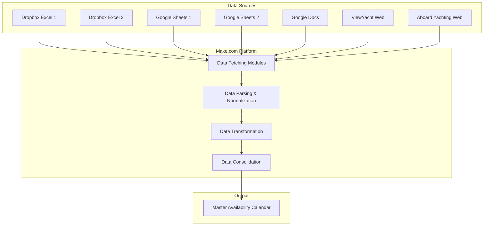

# Yacht Booking Consolidation System - Architecture Plan

## Project Overview

**Client:** Petra (via Letion)  
**Objective:** Consolidate yacht booking data from multiple sources (Dropbox Excel files, Google Sheets, and web pages) into a unified availability calendar using Make.com automation platform.

**Key Requirement:** Create a master calendar where:
- **Rows:** Dates (e.g., July 4-11, 2026)
- **Columns:** Yacht names
- **Cell Content:** Booking status (occupied/available) + embarkation/disembarkation ports

## Data Sources Analysis

### Source 1: Dropbox - Booking-list-2026.xlsx
- **URL:** `https://www.dropbox.com/scl/fi/deid2vre5zs4g28m4vqrr/Booking-list-2026.xlsx`
- **Type:** Excel file
- **Access Method:** Dropbox API or direct download link
- **Expected Format:** Unknown (needs inspection)

### Source 2: Google Sheets - Main Booking Sheet
- **URL:** `https://docs.google.com/spreadsheets/d/1Tfz1IPfd_e-I97LQKeQ6qUKs9zrlJ1TuqOa1aSlz9KM/edit`
- **Type:** Google Sheets
- **Access Method:** Google Sheets API
- **Expected Format:** Unknown (needs inspection)

### Source 3: ViewYacht - Angelica
- **URL:** `https://www.viewyacht.com/angelica/index.php/4`
- **Type:** Web page
- **Access Method:** HTTP scraping or API if available
- **Expected Format:** HTML table or structured data

### Source 4: Aboard Yachting Croatia
- **URL:** `https://abordayachting.hr/yachting-croatia-2/`
- **Type:** Web page
- **Access Method:** HTTP scraping
- **Expected Format:** HTML content

### Source 5: Dropbox - Saint Luca booking2026.xlsx
- **URL:** `https://www.dropbox.com/scl/fo/wij79sltbhysd0kafp9s7/.../Saint%20Luca%20-%20booking2026.xlsx`
- **Type:** Excel file in folder
- **Access Method:** Dropbox API
- **Expected Format:** Unknown (needs inspection)

### Source 6: Google Sheets - Secondary Booking Sheet
- **URL:** `https://docs.google.com/spreadsheets/d/1qrcGvth_FGTqQQTJGNWzQ6EkWBudFwsX/edit`
- **Type:** Google Sheets
- **Access Method:** Google Sheets API
- **Expected Format:** Unknown (needs inspection)

### Source 7: Google Docs
- **URL:** `https://docs.google.com/document/d/1NhdYhkkzNLShxrgCfasAXJ_GShn8Lkjd/edit`
- **Type:** Google Docs
- **Access Method:** Google Docs API
- **Expected Format:** Text document (may contain booking info)

## System Architecture

### High-Level Architecture



### Data Flow Architecture


## Unified Data Schema

### Master Calendar Structure

| Date Range | Yacht 1 | Yacht 2 | Yacht 3 | ... | Yacht N |
|------------|---------|---------|---------|-----|---------|
| 2026-07-04 to 2026-07-11 | OCCUPIED<br>Embark: Split<br>Disembark: Dubrovnik | AVAILABLE | OCCUPIED<br>Embark: Athens<br>Disembark: Mykonos | ... | ... |
| 2026-07-11 to 2026-07-18 | AVAILABLE | OCCUPIED<br>Embark: Venice<br>Disembark: Venice | AVAILABLE | ... | ... |

### Normalized Data Model

```json
{
  "booking": {
    "yacht_name": "string",
    "start_date": "YYYY-MM-DD",
    "end_date": "YYYY-MM-DD",
    "embarkation_port": "string",
    "disembarkation_port": "string",
    "status": "occupied|available|tentative",
    "source": "string",
    "last_updated": "timestamp"
  }
}
```

## Make.com Implementation Strategy

### Scenario 1: Dropbox Excel Files Processor

**Modules:**
1. **Dropbox - Download File** (for each Excel file)
2. **Parse Excel** - Extract booking data
3. **Iterator** - Loop through rows
4. **Data Transformer** - Normalize to standard format
5. **Data Store** - Store in temporary collection

**Key Transformations:**
- Convert various date formats to ISO 8601
- Extract yacht names from headers/columns
- Identify embarkation/disembarkation columns
- Handle merged cells for date ranges

### Scenario 2: Google Sheets Processor

**Modules:**
1. **Google Sheets - Get Range Values** (for each sheet)
2. **Iterator** - Loop through rows
3. **Data Transformer** - Normalize to standard format
4. **Data Store** - Store in temporary collection

**Key Transformations:**
- Parse date ranges (e.g., "July 4-11" → "2026-07-04" to "2026-07-11")
- Extract yacht names from columns
- Map port abbreviations to full names
- Handle different owner formatting styles

### Scenario 3: Web Scraper

**Modules:**
1. **HTTP - Make a Request** (for each web URL)
2. **HTML Parser** - Extract booking tables
3. **Text Parser** - Extract dates and yacht info
4. **Data Transformer** - Normalize to standard format
5. **Data Store** - Store in temporary collection

**Key Transformations:**
- Parse HTML tables
- Extract structured data from unstructured text
- Handle calendar widgets or booking systems
- Convert relative dates to absolute dates

### Scenario 4: Data Consolidation & Master Sheet Generator

**Modules:**
1. **Data Store - Search Records** - Retrieve all normalized bookings
2. **Aggregator** - Group by date range
3. **Array Aggregator** - Build yacht columns
4. **Tools - Set Variables** - Build matrix structure
5. **Google Sheets - Clear a Range** - Clear master sheet
6. **Google Sheets - Add Rows** - Write consolidated data
7. **Google Sheets - Format Cells** - Apply conditional formatting

**Logic:**
- Generate date range list (e.g., weekly intervals for 2026)
- For each date range, check all yachts for bookings
- Mark cells as OCCUPIED or AVAILABLE
- Add embarkation/disembarkation info to occupied cells
- Apply color coding (red=occupied, green=available)

## Data Normalization Challenges

### Challenge 1: Inconsistent Date Formats
**Problem:** Different owners use different date formats
- "July 4-11"
- "04.07.2026 - 11.07.2026"
- "7/4/26 - 7/11/26"
- "Week 27"

**Solution:** Create comprehensive date parser with multiple format handlers

### Challenge 2: Yacht Name Variations
**Problem:** Same yacht may have different names across sources
- "Angelica"
- "M/Y Angelica"
- "ANGELICA"

**Solution:** Create yacht name mapping table with aliases

### Challenge 3: Port Name Variations
**Problem:** Ports may be abbreviated or spelled differently
- "Split" vs "SPL" vs "Split, Croatia"
- "Dubrovnik" vs "DBV" vs "Dubrovnik, HR"

**Solution:** Create port mapping table with standardized names

### Challenge 4: Overlapping Bookings
**Problem:** Same yacht may appear booked in multiple sources for same dates

**Solution:** Implement conflict detection and resolution rules:
- Priority by source (e.g., owner's sheet > aggregator sheet)
- Flag conflicts for manual review
- Use "last updated" timestamp

### Challenge 5: Different Booking Granularity
**Problem:** Some sources show daily bookings, others weekly

**Solution:** Normalize to daily level, then aggregate to weekly view

## Technical Requirements

### Make.com Modules Needed
- Dropbox (Download File, List Files)
- Google Sheets (Get Range, Update Range, Clear Range, Format Cells)
- Google Docs (Get Document Content)
- HTTP (Make a Request)
- Tools (Set Variable, Get Variable, Text Parser, Compose)
- Data Store (Add Record, Search Records, Delete Records)
- Iterator
- Array Aggregator
- Router

### External Services
- Dropbox API access (OAuth token)
- Google Workspace API access (OAuth token with Sheets & Docs permissions)
- Make.com account with sufficient operations quota

### Data Storage
- Make.com Data Store for temporary normalized data
- Google Sheets as master output destination
- Optional: Database for historical tracking

## Implementation Phases

### Phase 1: Data Source Analysis
- Manually inspect each source
- Document actual data structure
- Identify yacht names across all sources
- Create yacht name mapping table
- Create port name mapping table

### Phase 2: Individual Source Processors
- Build Dropbox Excel processor
- Build Google Sheets processor
- Build Google Docs processor
- Build web scraper
- Test each processor independently

### Phase 3: Data Normalization Layer
- Implement date parser
- Implement yacht name normalizer
- Implement port name normalizer
- Create validation rules
- Test normalization with sample data

### Phase 4: Consolidation Engine
- Build date range generator
- Build yacht-date matrix builder
- Implement conflict detection
- Create master sheet writer
- Apply formatting rules

### Phase 5: Testing & Refinement
- Test with full dataset
- Validate accuracy against source data
- Handle edge cases
- Optimize performance
- Add error handling

### Phase 6: Automation & Monitoring
- Set up scheduled execution
- Add error notifications
- Create execution logs
- Document user guide
- Train end users

## Output Specifications

### Master Calendar Sheet Structure

**Sheet Name:** "Yacht Availability 2026"

**Column A:** Date Range (format: "YYYY-MM-DD to YYYY-MM-DD")
**Columns B-Z+:** Yacht names (one per column)

**Cell Format for Occupied:**
```
OCCUPIED
Embark: [Port Name]
Disembark: [Port Name]
```

**Cell Format for Available:**
```
AVAILABLE
```

**Conditional Formatting:**
- Occupied cells: Red background (#FF0000), white text
- Available cells: Green background (#00FF00), black text
- Tentative cells: Yellow background (#FFFF00), black text

### Additional Sheets

**Sheet: "Yacht Directory"**
- List of all yacht names
- Aliases/variations
- Primary source for each yacht

**Sheet: "Port Directory"**
- List of all ports
- Abbreviations
- Country
- Coordinates (optional)

**Sheet: "Data Sources"**
- List of all source URLs
- Last sync timestamp
- Status (active/error)

**Sheet: "Conflicts Log"**
- Date range
- Yacht name
- Conflicting sources
- Resolution status

## Success Criteria

1. **Data Completeness:** All 7 sources successfully fetched and parsed
2. **Data Accuracy:** >95% accuracy in booking status vs source data
3. **Automation Reliability:** Successful execution >98% of scheduled runs
4. **Performance:** Complete refresh in <5 minutes
5. **Usability:** Petra can quickly identify available yachts for any date range
6. **Maintainability:** Easy to add new sources or modify existing ones

## Risk Assessment

### High Risk
- **Web scraping instability:** Websites may change structure
  - *Mitigation:* Build robust parsers with fallback logic, add monitoring

- **API rate limits:** Google/Dropbox may throttle requests
  - *Mitigation:* Implement request batching and retry logic

### Medium Risk
- **Data format changes:** Owners may change their booking list formats
  - *Mitigation:* Build flexible parsers, add validation alerts

- **Conflicting data:** Same yacht booked differently in multiple sources
  - *Mitigation:* Implement conflict detection and manual review workflow

### Low Risk
- **Make.com operations quota:** May exceed free tier limits
  - *Mitigation:* Optimize scenario efficiency, consider paid plan

## Questions for Petra

Before proceeding with implementation, I need clarification on:

1. **Date Range Granularity:** Should the master calendar show:
   - Daily rows (365 rows for 2026)?
   - Weekly rows (52 rows for 2026)?
   - Custom date ranges matching typical charter periods (Saturday-Saturday)?

2. **Yacht List:** Do you have a complete list of all yacht names that should appear as columns? This will help with name normalization.

3. **Update Frequency:** How often should the automation run?
   - Real-time (on-demand)?
   - Hourly?
   - Daily?
   - Weekly?

4. **Access Permissions:** Do you have:
   - Edit access to all Google Sheets/Docs?
   - Dropbox access tokens or ability to generate them?
   - Permission to access the web pages programmatically?

5. **Output Location:** Where should the master calendar be created?
   - New Google Sheet?
   - Existing Google Sheet (provide URL)?
   - Excel file in Dropbox?

6. **Conflict Resolution:** When the same yacht appears booked in multiple sources for overlapping dates, which source should take priority?

7. **Historical Data:** Do you need to preserve historical booking data, or only current/future bookings?

8. **Additional Data:** Besides embarkation/disembarkation ports, do you need:
   - Guest names?
   - Booking reference numbers?
   - Price information?
   - Special requirements?

## Next Steps

Once the questions above are answered:

1. Create detailed data mapping document for each source
2. Set up Make.com account and connect required services
3. Build and test individual source processors
4. Develop normalization and consolidation logic
5. Create master calendar output
6. Test end-to-end workflow
7. Deploy automation and monitor initial runs
8. Provide documentation and training

---

**Document Version:** 1.0  
**Created:** 2026-02-14  
**Author:** Architect Mode  
**Status:** Awaiting Client Feedback
